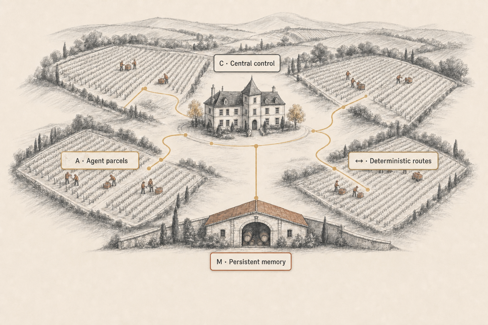
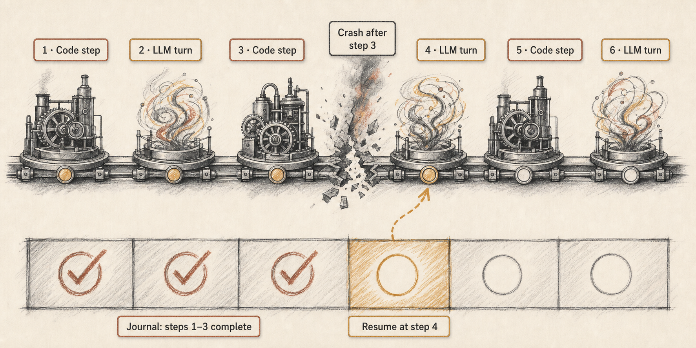

<p align="center">
  
</p>

<h1 align="center">Pinard</h1>

<p align="center"><strong>One conductor. Many agents. One harvest.</strong></p>

<p align="center">
  A distributed engine for running fleets of LLM agents through reliable,<br>
  resumable, and auditable semi-deterministic loops.
</p>

<p align="center">
  <a href="website/content/docs/overview.md">Overview</a> ·
  <a href="website/content/docs/getting-started.md">Getting started</a> ·
  <a href="website/content/docs/cli-reference.md">CLI reference</a> ·
  <a href="website/content/docs/architecture.md">Architecture</a>
</p>

---

Pinard wraps capable but unpredictable agents in **semi-deterministic loops**:
ordinary code owns the control flow, while the model supplies bounded judgment
inside individual steps. Every step is journaled, so interrupted work can resume
instead of starting over.

Agents can run across repositories, workstations, and HPC nodes. They communicate
over NATS JetStream, retain distilled knowledge in persistent memory, and remain
observable from a browser without requiring inbound SSH.

Three pillars hold the system together:

> **Deterministic control** · **Non-deterministic agents** · **Persistent memory**

<p align="center">
  
</p>

<p align="center"><em>One coordinated estate: independent workers connected by deterministic routes to shared control and durable memory.</em></p>

## Why Pinard?

| A free-running agent | A Pinard loop |
|---|---|
| Lets the model decide the path | Keeps sequencing, branching, and stopping in code |
| Loses progress when the session crashes | Resumes from a stable run journal |
| Returns prose that downstream steps must interpret | Uses bounded tasks with structured outputs |
| Hides what happened inside a long conversation | Records steps, outcomes, gates, and verdicts |
| Relearns the same operational lessons | Recalls curated knowledge across sessions |
| Is difficult to coordinate across hosts | Runs as one worker in a distributed fleet |

The result is not a more elaborate prompt. It is an execution model for agent work
that needs to survive real infrastructure, real failures, and real review cycles.

## How work flows

<p align="center">
  
</p>

<p align="center"><em>Fixed control, bounded judgment: after a failure, the journal skips completed work and resumes at the next open step.</em></p>

1. A schedule, event, GitLab issue, operator, or conductor triggers work.
2. The daemon spawns a **vendangeur** (worker), normally in an isolated git
   worktree, with a stable run ID.
3. A versioned `process.js` advances through deterministic code steps and bounded
   LLM tasks.
4. Each completed task and breakpoint is written to the run journal.
5. If the worker or host fails, the same run resumes at the next incomplete step.
6. Reusable discoveries are distilled into memory, and the worker is reaped when
   the loop reaches a terminal outcome.

Read [The Semi-Deterministic Loop](website/content/docs/semi-deterministic-loop.md)
for the execution model and
[Authoring Processes](website/content/docs/authoring-processes.md) to build one.

## What Pinard provides

- **Processes as code** — versioned JavaScript runbooks with typed tasks,
  deterministic branches, breakpoint gates, and terminal results.
- **Journaled execution** — stable run IDs make crashes, reboots, and multi-day
  work resumable and auditable.
- **Distributed agents** — workers communicate exclusively over NATS and can run
  locally, on another workstation, or inside an HPC/Singularity environment.
- **Fleet orchestration** — a daemon handles mechanical coordination; optional
  régisseur and maître agents add conversational estate- and workstream-level control.
- **Persistent memory** — local-first, curated knowledge is injected at boot and
  fetched in full only when relevant.
- **GitLab automation** — issue dispatch, isolated worktrees, MR tracking, review
  forwarding, bounded pipeline repair, optional auto-merge, and deterministic cleanup.
- **Scheduled work** — cron-driven spawns include missed-run backfill and explicit
  outcome events.
- **Live browser terminals** — observe remote tmux sessions over NATS, read-only by
  default, without opening inbound SSH.
- **Cuvée branches** — combine concurrent changes through an intermediate branch
  before they reach the repository's default branch.
- **Portable funding contracts** — optional Capsule Protocol support can fund a
  worker without coupling the protocol to a specific application.

## Built-in SWE loop

Pinard includes one production application of the engine: a GitLab issue-to-merge
loop.

```text
authorized issue
    → isolated vendangeur
    → implementation and tests
    → merge request
    → review and pipeline feedback
    → merge or explicit terminal failure
    → post-merge monitoring and cleanup
```

Review comments and failed pipelines return to the worker that owns the change.
Pipeline repair is bounded by a circuit breaker. Auto-merge is **off by default**;
when enabled, it still requires a green pipeline, approval, no unresolved threads,
and a non-draft MR.

This is one process, not the definition of Pinard. The same engine can drive data
operations, audits, recurring maintenance, or any workflow expressed as bounded
agent tasks inside deterministic control flow.

See [The SWE Process](website/content/docs/swe-process.md) for the complete lifecycle.

## Quick start

### 1. Install from source

Pinard requires Go, Node.js ≥ 22.19.0, Pi, `git`, `glab`, `tmux`, and `fzf` when
installed from a checkout.

```bash
git clone --recurse-submodules https://github.com/Genentech/pinard.git
cd pinard
./install
```

Linux release bundles include the Node and Pi runtime. See
[Getting Started](website/content/docs/getting-started.md) for both installation
paths and exact prerequisites.

### 2. Configure credentials

Pinard has no built-in hosts or credentials. Copy the template, provide a dedicated
GitLab service account and NATS connection, then export the referenced secrets:

```bash
mkdir -p ~/.config/pinard
cp credentials.example.yaml ~/.config/pinard/credentials.yaml

export PINARD_GITLAB_TOKEN="glpat-…"
export PINARD_NATS_PASSWORD="…"
```

See [Configuration](website/content/docs/configuration.md) for the complete schema.

### 3. Create an estate and register a repository

```bash
aoc init myproject --gitlab-host gitlab.example.com --gitlab-group mygroup
cd ~/vignoble-myproject

aoc add vigne my-api \
  --path ~/my-api \
  --repo mygroup/my-api

aoc daemon status
```

`aoc init` scaffolds the vignoble and starts its self-supervising daemon. Add
`--auto-merge` to a vigne only when you explicitly want Pinard to merge eligible
MRs automatically.

### 4. Run work

Spawn a worker directly:

```bash
aoc spawn --project my-api --prompt "Fix the authentication bug and open an MR"
```

Or launch the optional conductor control room:

```bash
pinard
```

The built-in SWE workflow can also start from an owner-authorized GitLab issue
assigned to the configured Pinard service account.

## The estate vocabulary

The wine terms describe real scopes and responsibilities rather than decorative
aliases:

| Term | Meaning |
|---|---|
| **Vignoble** | The workspace or estate containing repositories, workstreams, state, and configuration |
| **Vigne** | One registered repository |
| **Parcelle** | A persistent workstream spanning tasks, agents, and days |
| **Régisseur** | Optional top-level conductor for the vignoble |
| **Maître** | Optional conductor scoped to one parcelle |
| **Vendangeur** | A worker agent running one loop to completion |
| **Cuvée** | An intermediate branch that blends several agents' changes before `main` |

User-facing surfaces say **vendangeur**; code, CLI flags, and configuration continue
to use **worker** where that is the established interface.

## Components

| Component | Responsibility |
|---|---|
| `aoc` | Go CLI for setup, daemon operation, spawning, status, schedules, terminals, and administration |
| Daemon | Always-on, model-free engine for watchers, schedules, dispatch, recovery, and memory service ownership |
| `pinard` | Launcher for the régisseur, maîtres, and workers |
| Babysitter | Executes a semi-deterministic process step by step and owns its journal |
| NATS JetStream | The single communication bus between components and hosts |
| Engram + wiki | Local-first memory, curated knowledge, and best-effort cloud replication |

For topology, subjects, state files, and session layout, see
[Architecture](website/content/docs/architecture.md).

## Documentation

| Start here | Then go deeper |
|---|---|
| [Overview](website/content/docs/overview.md) | [Architecture](website/content/docs/architecture.md) |
| [Getting Started](website/content/docs/getting-started.md) | [Orchestration & Parcelles](website/content/docs/orchestration.md) |
| [The Semi-Deterministic Loop](website/content/docs/semi-deterministic-loop.md) | [Memory & Recall](website/content/docs/memory.md) |
| [Authoring Processes](website/content/docs/authoring-processes.md) | [Distributed & Remote Execution](website/content/docs/remote-workers.md) |
| [The SWE Process](website/content/docs/swe-process.md) | [Scheduling](website/content/docs/scheduling.md) |
| [CLI Reference](website/content/docs/cli-reference.md) | [Web Terminal](website/content/docs/web-terminal.md) |
| [Configuration](website/content/docs/configuration.md) | [Capsule Protocol](website/content/docs/capsules.md) |

## Development

```bash
go build ./...
go test ./...

cd pi-extension
npm ci
npm test
```

See [CONTRIBUTING.md](CONTRIBUTING.md) for the contribution workflow and DCO
requirements. Report vulnerabilities through the process in
[SECURITY.md](SECURITY.md).

## License

Pinard is released under the [MIT License](LICENSE).

<p align="center">
  
</p>
